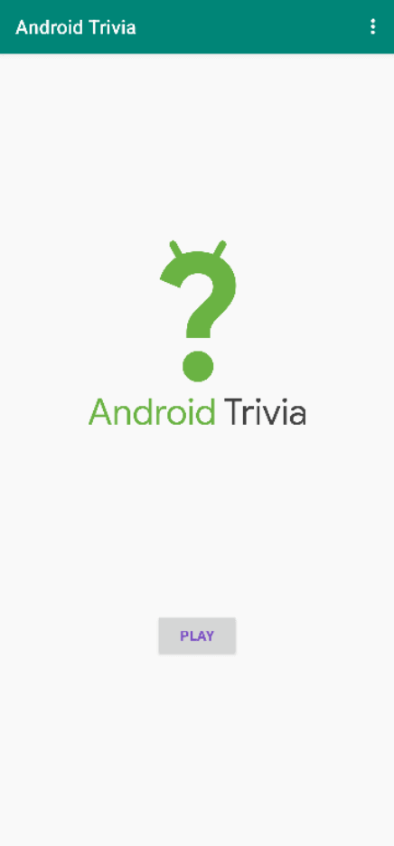

<h1 align="center">Android Trivia - An App Navigation based Quiz App</h1>

## Built With
- [Android Studio](https://developer.android.com/studio)
- [Kotlin](https://developer.android.com/kotlin)
- Github Copilot

## Features
- A Quiz app with 10+ questions
- App Navigation
- Back Button
- About Section
- Share Options
- Sidebar

## Preview
- Suppose, if we play the Android Trivia app, we can see the app like this : 

 
   

